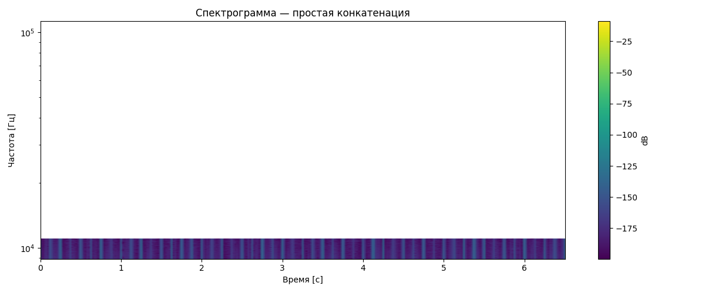
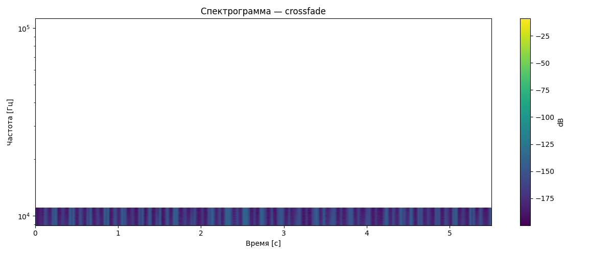

# Лабораторная работа №10
## Обработка голоса

### Вариант 2. Синтезатор речи

### Исходные данные
- Формат дорожек: WAV, моно.
- Частота дискретизации: `22050` Гц.
- База образцов: синтезированные фонемы и аллофоны русского языка, `63` файла.
- Синтезируемая фраза: `Хорошо живёт на свете Винни-Пух`.

### Теоретическая основа
Фонема рассматривается как минимальная звуковая единица, а аллофон — как вариант её реализации. Для гласных используется тональный источник, для согласных — шумовой или смешанный источник. Синтез выполняется соединением звуковых фрагментов.

### Формулы
```text
X(m,k) = Σ x[n] w[n-mR] exp(-j 2πkn/N)
P(m,k) = |X(m,k)|²
crossfade = left·(1-a) + right·a, a ∈ [0,1]
```

### 1. Образцы фонем
- Каталог образцов: `phonemes/*.wav`.
- Количество файлов: `63`.

### 2. Синтез фразы
Фраза транскрибирована в цепочку фонем и аллофонов:

```text
h-a_red-r-a_red-sh-o-zh-y_mid-v_soft-o-t-n-a_red-s-v_soft-e-t_soft-i_red-v_soft-i-n-n_soft-i_red-p-u-h
```

| Дорожка | Файл |
|:--|:--|
| Простая конкатенация | `results/simple_concat.wav` |
| Перекрёстное затухание | `results/crossfade_concat.wav` |

### 3. Спектрограммы
Спектрограммы построены через STFT с окном Ханна и логарифмической шкалой частот.

| Простая конкатенация | Crossfade |
|:--:|:--:|
|  |  |

### 4. Сравнение склейки

#### Простая конкатенация
- фонемы соединяются напрямую;
- на границах могут возникать резкие переходы;
- возможны щелчки и неестественное звучание.

#### Crossfade
- конец предыдущей фонемы плавно затухает;
- начало следующей фонемы плавно нарастает;
- переходы становятся мягче.

### Вывод
Реализован синтезатор речи для варианта 2: создан набор из 63 образцов фонем и аллофонов, фраза «Хорошо живёт на свете Винни-Пух» синтезирована по фонетической транскрипции, сравнены простая конкатенация и монтаж с перекрёстным затуханием. Метод crossfade уменьшает резкие переходы на границах фрагментов и делает звучание более плавным.
