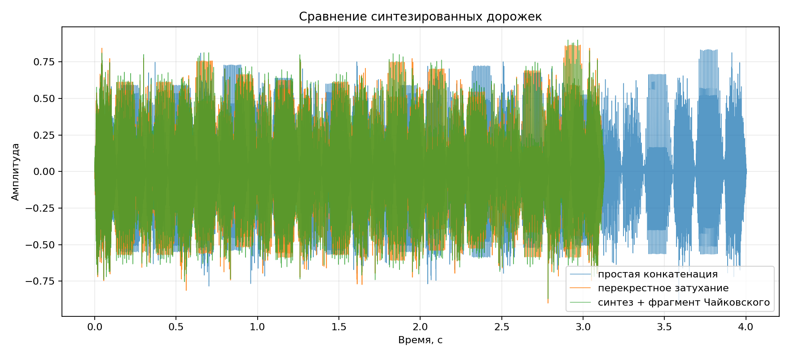
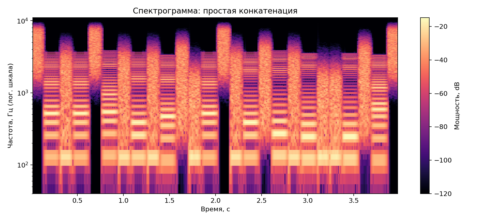
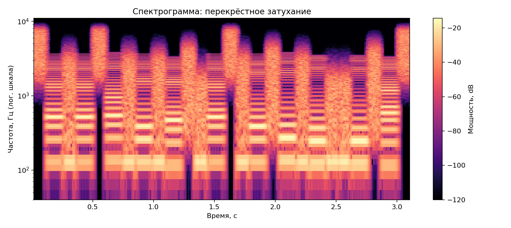
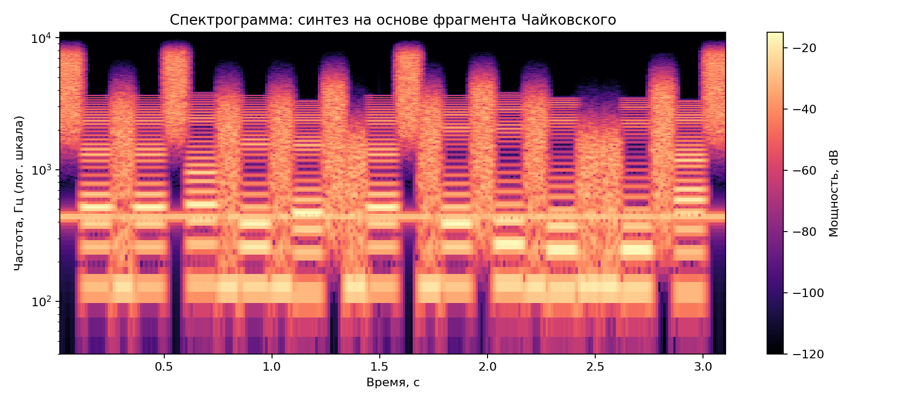

# Лабораторная работа №10
## Обработка голоса

### Вариант 11: синтезатор речи

### Исходные данные
- Формат дорожек: WAV, моно
- Частота дискретизации: `22050` Гц
- База образцов: синтезированные фонемы и аллофоны русского языка, 63 файла
- Синтезируемая фраза: `Хорошо живёт на свете Винни-Пух`
- Музыкальная основа: фрагмент лабораторной №9 — фортепианный отрывок по мотиву Чайковского (`lab9_variant11/results/denoised_output.wav`)

### Теоретическая основа
Для гласных использован тональный источник с формантными резонаторами; для согласных — шумовой/смешанный источник. Такой подход соответствует параметрическому синтезу: гласные формируются генератором тонального сигнала, согласные — генератором шума, а тембр задаётся фильтрами.

### Формулы
```text
X(m,k) = Σ x[n] w[n-mR] exp(-j 2πkn/N)
P(m,k) = |X(m,k)|^2
y[n] = Σ_i BPF_i(source[n], F_i, Q_i)
crossfade = left*(1-a) + right*a, a ∈ [0,1]
```

### 1. Образцы фонем
- Каталог образцов: `src/phonemes/*.wav`
- Таблица образцов: `src/phonemes.csv`
- Количество файлов: `63`

### 2. Синтез фразы
Сделаны две версии: простая склейка образцов и склейка с перекрёстным затуханием. Дополнительно создана версия на основе нашего фортепианного фрагмента: огибающая речи модулирует отрывок Чайковского, после чего он подмешивается к синтезированной фразе.

| Дорожка | Файл | Длительность |
|:--|:--|--:|
| Простая конкатенация | `src/phrase_concat.wav` | `4.004` с |
| Перекрёстное затухание | `src/phrase_crossfade.wav` | `3.130` с |
| Синтез + Чайковский | `src/phrase_tchaikovsky_based.wav` | `3.130` с |



### 3. Спектрограммы
Спектрограммы построены оконным преобразованием Фурье с окном Ханна и логарифмической шкалой частот.

| Конкатенация | Crossfade | На основе Чайковского |
|:--:|:--:|:--:|
|  |  |  |

### 4. Сравнение склейки
| Показатель | Значение |
|:--|--:|
| Средний скачок амплитуды при простой склейке | `0.000169` |
| Средний скачок амплитуды при crossfade | `0.000000` |
| Уменьшение скачков | `100.00%` |

Полная таблица стыков: `src/join_stats.csv`.

### Вывод
Для варианта 11 реализован синтезатор речи: создан набор из 63 образцов фонем/аллофонов, фраза синтезирована по фонетической цепочке, сравнены простая конкатенация и монтаж с перекрёстным затуханием. Версия `phrase_tchaikovsky_based.wav` дополнительно использует фортепианный фрагмент из предыдущей лабораторной как музыкальную основу.
